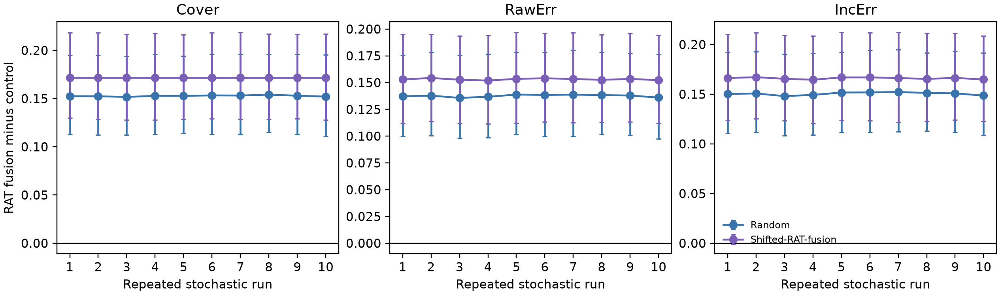
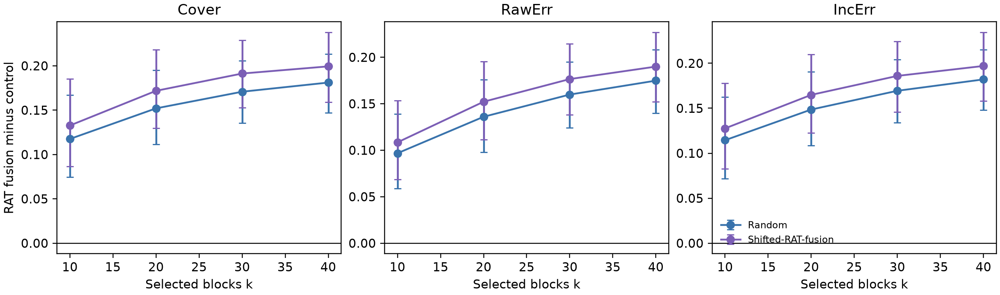

# E1--E2 Evidence Report

The manuscript was not modified for these runs. E1 and E2 use the frozen 20-video diagnostic subset and the same fixed DCT-Gaussian allocation protocol as the current main experiment.

## E1: Multi-seed robustness

- Protocol: 20 videos x 10 master seeds x 7 policies = 1,400 completed policy runs.
- Seeds: 0--8 and 42. The seed values are retained in the trace files; the figure labels them only as ten repeated stochastic runs.
- Fixed setting: `k=20`, `epsilon=8`, and `delta=1e-4` for every run.
- Failures or invalid metrics: 0.
- Statistical unit: video. Metrics are first averaged across the ten seeds for each video and policy; the sign test and bootstrap interval are then computed across 20 paired videos.

| Comparison | Metric | Wins | Mean difference | 95% bootstrap CI | Sign-test p |
|---|---|---:|---:|---:|---:|
| RAT fusion - Random | Cover | 20/20 | +0.152749 | [0.112991, 0.195044] | 0.000002 |
| RAT fusion - Random | RawErr | 20/20 | +0.137570 | [0.100651, 0.177838] | 0.000002 |
| RAT fusion - Random | IncErr | 20/20 | +0.150457 | [0.111900, 0.192305] | 0.000002 |
| RAT fusion - Shifted fusion | Cover | 20/20 | +0.171796 | [0.128850, 0.216774] | 0.000002 |
| RAT fusion - Shifted fusion | RawErr | 20/20 | +0.153093 | [0.112138, 0.195990] | 0.000002 |
| RAT fusion - Shifted fusion | IncErr | 20/20 | +0.165993 | [0.123275, 0.209797] | 0.000002 |
| RAT fusion - RAT+traj | Cover | 12/20 | +0.007298 | [-0.007192, 0.022073] | 0.503445 |
| RAT fusion - RAT+traj | RawErr | 12/20 | +0.006631 | [-0.006631, 0.020177] | 0.503445 |
| RAT fusion - RAT+traj | IncErr | 12/20 | +0.007246 | [-0.007200, 0.022467] | 0.503445 |

Across the ten individual runs, the RAT-minus-Random mean difference remains positive for every metric. The ranges are +0.151639 to +0.154026 for Cover, +0.135710 to +0.138806 for RawErr, and +0.148048 to +0.152198 for IncErr. The evidence therefore strengthens robustness to the tested stochastic realizations. It does not change the negative trajectory result: RAT+traj remains statistically unresolved relative to RAT fusion.

Trace files: `E1_multi_seed/metrics.csv`, `E1_multi_seed/run_manifest.csv`, `E1_multi_seed/per_video_seed_aggregated.csv`, `E1_multi_seed/seed_level_deltas.csv`, and `E1_multi_seed/paired_stats.csv`.

## E2: Selected-area sensitivity

- Protocol: 20 videos x 4 budgets x 7 policies = 560 completed policy runs.
- Budgets: `k in {10, 20, 30, 40}`.
- Calibration: sigma is recomputed for each clip and budget while keeping `epsilon=8` and `delta=1e-4`.
- Failures or invalid metrics: 0.
- Statistical unit: video within each value of `k`.

| k | Control | Cover difference | RawErr difference | IncErr difference | Paired wins |
|---:|---|---:|---:|---:|---:|
| 10 | Random | +0.117515 | +0.096773 | +0.114485 | 20/20, 20/20, 20/20 |
| 10 | Shifted fusion | +0.132685 | +0.108467 | +0.127620 | 19/20, 19/20, 19/20 |
| 20 | Random | +0.152005 | +0.135991 | +0.148560 | 20/20, 20/20, 20/20 |
| 20 | Shifted fusion | +0.171796 | +0.152177 | +0.164864 | 20/20, 20/20, 20/20 |
| 30 | Random | +0.170780 | +0.159891 | +0.169404 | 20/20, 20/20, 20/20 |
| 30 | Shifted fusion | +0.191284 | +0.176546 | +0.185951 | 20/20, 20/20, 20/20 |
| 40 | Random | +0.181106 | +0.174858 | +0.182064 | 20/20, 20/20, 20/20 |
| 40 | Shifted fusion | +0.199359 | +0.189963 | +0.197008 | 20/20, 20/20, 20/20 |

All RAT-minus-control mean differences are positive across all four budgets. At `k=10`, RAT wins 19/20 videos against Shifted fusion; every other listed comparison is 20/20. This strengthens the bounded conclusion that the observed allocation advantage is not unique to `k=20`. Absolute changes across budgets should not be interpreted without the corresponding area and sigma changes.

Trace files: `E2_k_sensitivity/metrics.csv`, `E2_k_sensitivity/run_manifest.csv`, `E2_k_sensitivity/aggregate.csv`, and `E2_k_sensitivity/paired_stats.csv`.

## Evidence-use decision

1. **Highest-value new main-paper figure:** E2. It answers the direct objection that the result may be specific to the single selected-area budget `k=20`, and it communicates three metrics compactly.
2. **High-value compact result:** E1. The repeated-run evidence is strong, but the full figure is less space-efficient than a one-sentence result or a small table in a four-page paper.
3. **Retain from the existing manuscript:** the qualitative Raw / Motion reference / RAT / Random / Shifted mask comparison. It explains what the controls mean and complements rather than duplicates E1/E2.
The frozen main paper follows this allocation: E1 is reported compactly in
text, E2 supplies the quantitative sensitivity panel, and the qualitative mask
comparison supplies the companion panel.
